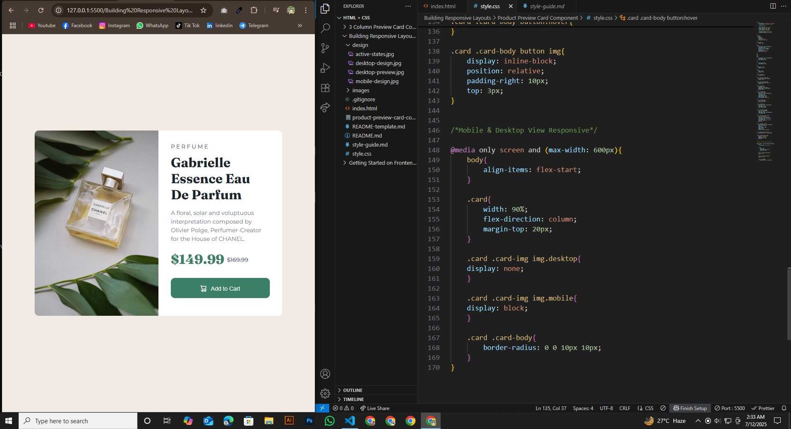

# Frontend Mentor - Product-Preview-Card-Component-Challenge

This is a solution to the [Product Preview Card Component Challenge](https://www.frontendmentor.io/challenges/product-preview-card-component-GO7UmttRfa) on [Frontend Mentor](https://www.frontendmentor.io/challenges/qr-code-component-iux_sIO_H). Frontend Mentor challenges help me improve my coding skills by building realistic projects.

## Table of contents

- [Overview](#overview)
  - [Screenshot](#screenshot)
  - [Project Links](#links)
- [My Process](#my-process)
  - [Built with](#built-with)
  - [What I learned](#what-i-learned)
  - [Continued development](#continued-development)
  - [Useful resources](#useful-resources)
- [Author](#author)
- [Acknowledgments](#acknowledgments)


## Overview

### Screenshot





### Links

- Solution URL: (https://github.com/hemal6325/Recipe-Page-Challenge)
- Live Site URL: (https://hemal6325.github.io/Recipe-Page-Challenge/)

## My Process
I built this project using HTML and CSS, focusing on layout design and responsive styling. Through it, I learned Flexbox, Semantic Markup, and how to create visually balanced components.

### Built With

- HTML5 Semantic Structure
- CSS3 Custom Properties
- Flexbox
- Mobile First Workflow


### What I Learned

During this experience, I gained valuable skills and deeper understanding of the subject. It helped me improve my problem-solving abilities and boosted my confidence in applying new concepts.


```css

:root{
    --primaryFont: "Montserrat", sans-serif;
    --secondaryFont: "Fraunces", serif;

    --fontSize: 14px;

    --Black: hsl(212, 21%, 14%);
    --Grey: hsl(228, 12%, 48%);
    --Cream: hsl(30, 38%, 92%);
    --White: hsl(0, 0%, 100%);

    --Green500: hsl(158, 36%, 37%);
    --Green700: hsl(158, 42%, 18%);
}

*,
*::after,
*::before{
    margin: 0;
    padding: 0;
    list-style: none;
    box-sizing: border-box;
}

html, body{
    height: 100%;
}

body{
    font-family: var(--primaryFont);
    font-weight: 400;
    font-size: var(--fontSize);
    background: var(--Cream);
    display: flex;
    justify-content: center;
    align-items: center;
}

h1,
h2,
h3,
h4,
h5{
    font-family: var(--secondaryFont);
    font-weight: 700;
    margin-bottom: 15px;
}

p{
    font-weight: 400;
    margin-bottom: 15px;
}

img{
    max-width: 100%;
    height: auto;
}

.card{
    width: 600px;
    display: flex;
}

.card .card-img{
    flex-basis: 50%;
}

.card .card-img img.desktop{
    border-radius: 10px 0 0 10px;
    display: block;
}

.card .card-img img.mobile{
    border-radius: 10px 10px 0 0;
    display: none;
}

.card .card-body{
    flex-basis: 50%;
    background: var(--White);
    border-radius: 0 10px 10px 0;
    padding: 30px;
}

.card .card-body h6{
    color: var(--Grey);
    font-family: var(--primaryFont);
    font-size: 14px;
    font-weight: 500;
    padding-bottom: 10px;
    letter-spacing: 3px;
    text-transform: uppercase;
}

.card .card-body h2{
    color: var(--Black);
    font-size: 32px;
}

.card .card-body p{
    font-family: var(--primaryFont);
    font-size: 14px;
    line-height: 1.5em;
    color: var(--Grey);
}

.card .card-body p.price{
    color: var(--Green500);
    font-size: 32px;
    font-family: var(--secondaryFont);
    font-weight: 800;
}

.card .card-body p.price span{
    color: var(--Grey);
    font-size: var(--fontSize);
    font-family: var(--primaryFont);
    font-weight: 500;
    text-decoration: line-through;
    position: relative;
    top: -5px;
}

.card .card-body button{
    background-color: var(--Green500);
    color: var(--White);
    border: 0;
    border-radius: 10px;
    width: 100%;
    padding: 15px;
    font-size: var(--fontSize);
}

.card .card-body button:hover{
    background-color: var(--Green700);
}

.card .card-body button img{
    display: inline-block;
    position: relative;
    padding-right: 10px;
    top: 3px;
}


/*Mobile & Desktop View Responsive*/

@media only screen and (max-width: 600px){
    body{
        align-items: flex-start;
    }

    .card{
        width: 90%;
        flex-direction: column;
        margin-top: 20px;
    }

    .card .card-img img.desktop{
    display: none;
    }

    .card .card-img img.mobile{
    display: block;
    }

    .card .card-body{
        border-radius: 0 0 10px 10px;
    }
}

```

### Continued Development

I would like to make my own QR Generator so this could be used as a default template. The qr code could be links to a document or something along those ways. Going to think about something useful that could come in handy.

### Useful Resources

- [FLEXBOX FROGGY](https://flexboxfroggy.com/) - This helped me to understand better how to use flexbox.


## Author

- Frontend Mentor - [@hemal6325](https://www.frontendmentor.io/profile/hemal6325)
- GitHub Profile - [@hemal6325](https://github.com/hemal6325/)

## Acknowledgments


At some point i was a little stuck with setting the style for the image. And i solved this problem using online Resources, ChatGPT & Google Bard.


**Have Fun Building!** 🚀
